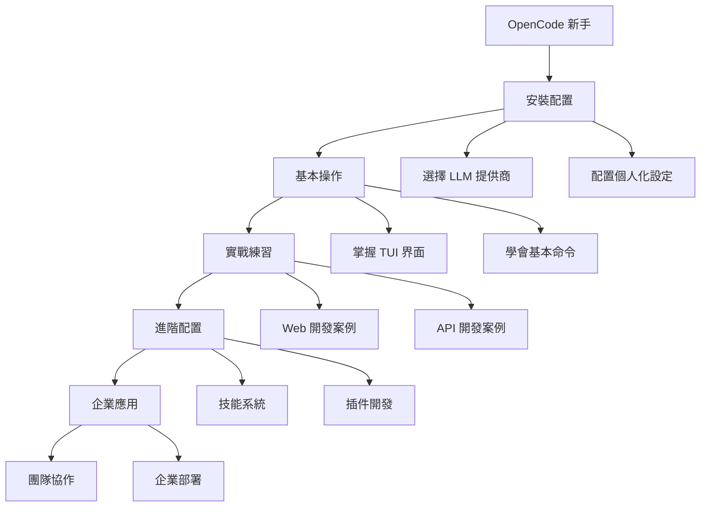

# 📚 OpenCode 完整使用指南

> **最全面的 OpenCode AI 編程助手中文使用指南**  
> 從入門到精通，讓 AI 成為你開發路上的最佳夥伴

---

## 🎯 歡迎來到 OpenCode 世界！

OpenCode 是一個革命性的開源 AI 編程助手，它將徹底改變你的開發方式。本指南將帶你從零開始，逐步掌握這個強大的工具。

## 🌟 為什麼選擇 OpenCode？

### 🚀 **強大的功能**
- **75+ LLM 提供商支援** - 從 OpenAI 到本地模型，選擇最適合你的
- **智能代理系統** - Build Agent 和 Plan Agent 協作完成複雜任務
- **多界面支援** - 終端、桌面、IDE，無處不在的 AI 伴侶
- **深度整合** - Git、Docker、VS Code，無縫融入你的工作流程

### 💡 **獨特的優勢**
- **開源透明** - 你的代碼從不離開你的機器
- **高度可定制** - 主題、快捷鍵、技能系統，打造個人化體驗
- **團隊協作** - 會話分享、權限管理，完美支援企業級應用
- **持續進化** - 活躍的社群和快速的版本更新

## 📖 本指南導航

### 🚀 **快速開始**
如果你是 OpenCode 新手，這裡是你的起點：

1. **[安裝配置](getting-started/installation.md)** - 一步步安裝和初始配置
2. **[第一次使用](getting-started/first-time.md)** - 從零開始的入門體驗
3. **[基本命令](getting-started/basic-commands.md)** - 核心功能快速掌握

### 🔧 **使用指南**
深入了解 OpenCode 的強大功能：

- **[TUI 界面](usage/tui-interface.md)** - 掌握終端用戶界面
- **[代理系統](usage/agents.md)** - 理解 Build vs Agent 的智慧分工
- **[命令詳解](usage/commands.md)** - 完整的命令參考手冊
- **[最佳實踐](usage/best-practices.md)** - 專業開發者的工作流程

### ⚙️ **配置詳解**
打造屬於你的個性化 OpenCode：

- **[主題設定](configuration/themes.md)** - 視覺風格完全自定義
- **[快捷鍵](configuration/keybinds.md)** - 效率提升的按鍵配置
- **[模型配置](configuration/models.md)** - 整合你偏好的 AI 模型
- **[自定義工具](configuration/custom-tools.md)** - 擴展 OpenCode 的可能性

### 🚀 **進階功能**
發揮 OpenCode 的全部潛力：

- **[技能系統](advanced/skills-system.md)** - 創建可重用的行為模式
- **[MCP 服務器](advanced/mcp-servers.md)** - 整合外部服務和 API
- **[插件開發](advanced/plugins.md)** - 自定義插件開發指南
- **[企業部署](advanced/enterprise.md)** - 團隊級別的配置管理

### 💡 **實戰案例**
真實場景的最佳實踐：

- **[Web 開發](examples/web-development.md)** - 前端開發完整工作流程
- **[API 開發](examples/api-development.md)** - 後端 API 開發最佳實踐
- **[機器學習](examples/machine-learning.md)** - AI 專案開發專用指南
- **[團隊協作](examples/team-collaboration.md)** - 多人開發協作模式

### 🔧 **故障排除**
解決常見問題和挑戰：

- **[常見問題](troubleshooting/common-issues.md)** - 典型問題的快速解決
- **[調試技巧](troubleshooting/debugging.md)** - 系統性問題診斷方法
- **[效能優化](troubleshooting/performance.md)** - 性能瓶頸分析和優化

## 🚀 立即開始你的 OpenCode 之旅

### 第一次接觸 OpenCode？

```bash
# 1. 安裝 OpenCode（擇一）
curl -fsSL https://opencode.ai/install | bash
# 或
npm install -g opencode-ai

# 2. 啟動並配置
opencode
/connect

# 3. 初始化你的專案
cd /path/to/your/project
opencode
/init
```

### 想要快速體驗？

```bash
# 簡單的問答測試
opencode run "解釋什麼是 React Hooks"

# 程式碼生成
opencode run "創建一個 Python 的 REST API 範例"

# 代碼審查
opencode run "審查這個函數的性能問題：..."
```

## 🎯 學習路徑建議

### 🎨 **視覺化學習路徑**


### 📈 **按經驗等級選擇**

#### 👶 **初學者**（0-6 個月程式設計經驗）
1. 從 [安裝配置](getting-started/installation.md) 開始
2. 學習 [第一次使用](getting-started/first-time.md) 的基礎概念
3. 掌握 [基本命令](getting-started/basic-commands.md) 的日常使用

#### 💻 **中級開發者**（1-3 年經驗）
1. 快速瀏覽 [快速開始](getting-started/) 章節
2. 重點學習 [使用指南](usage/) 中的進階技巧
3. 探索 [配置詳解](configuration/) 打造個人化體驗

#### 🏢 **高級開發者/架構師**（3+ 年經驗）
1. 直接跳到 [進階功能](advanced/) 章節
2. 專注於 [企業部署](advanced/enterprise.md) 和團隊協作
3. 參考 [實戰案例](examples/) 的最佳實踐

## 🤝 加入社群

### 🗣️ **交流討論**
- **[Discord 社群](https://opencode.ai/discord)** - 實時討論和問題解答
- **[GitHub Issues](https://github.com/anomalyco/opencode/issues)** - 錯誤回報和功能建議
- **[Reddit](https://reddit.com/r/opencode)** - 用戶經驗分享

### 📚 **持續學習**
- **[官方文檔](https://opencode.ai/docs)** - 英文原版文檔
- **[YouTube 教學](https://youtube.com/)** - 影片教學資源
- **[GitHub 倉庫](https://github.com/anomalyco/opencode)** - 了解最新開發動態

## 🏆 成功故事

### 💬 **用戶見證**

> "OpenCode 徹底改變了我的開發流程。以前需要幾小時的工作，現在幾分鐘就能完成。"  
> — *來自台灣的全端開發者*

> "我們團隊使用 OpenCode 後，代碼質量明顯提升，審查時間減少了 60%。"  
> — *新加坡某創新公司的技術主管*

### 📊 **數據說話**
- **650,000+** 每月活躍開發者
- **50,000+** GitHub Stars
- **75+** 支援的 LLM 提供商
- **24/7** 全球社群支援

## 🎁 福利時間！

### 🔥 **立即獲得的好處**
- ✅ **提升開發效率 40-60%**
- ✅ **減少程式錯誤和 bug**
- ✅ **自動化重複性工作**
- ✅ **24/7 AI 技術支援**
- ✅ **免費開源，永遠免費**

### 🎯 **長期價值**
- 🚀 **職業競爭力提升**
- 🧠 **程式設計思維進化**
- 🌐 **加入全球開發者社群**
- 💡 **掌握 AI 時代的開發趨勢**

---

## 🚀 準備好了嗎？

**世界正在快速進入 AI 輔助開發的新時代，**  
**OpenCode 將是你最強大的競爭優勢！**

👉 **[開始你的 OpenCode 之旅 →](getting-started/installation.md)**

---

<div align="center">
  <p><strong>讓 AI 成為你的超能力，一起創造更美好的未來！</strong></p>
  <p>使用 ❤️ 和 OpenCode 打造 | © 2025 OpenCode Guide 社群</p>
</div>